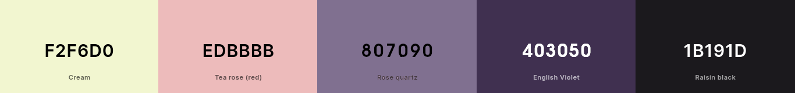
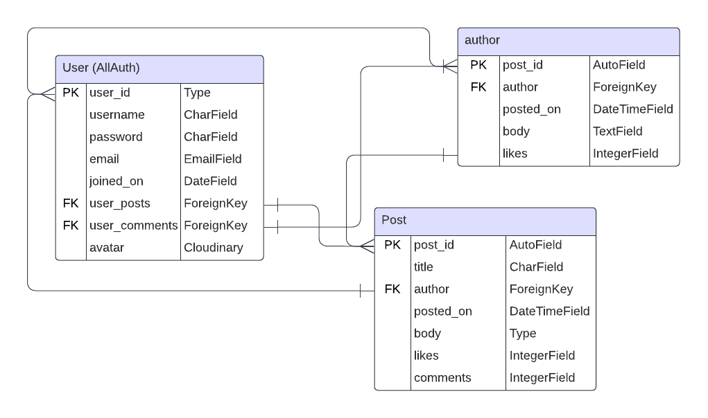
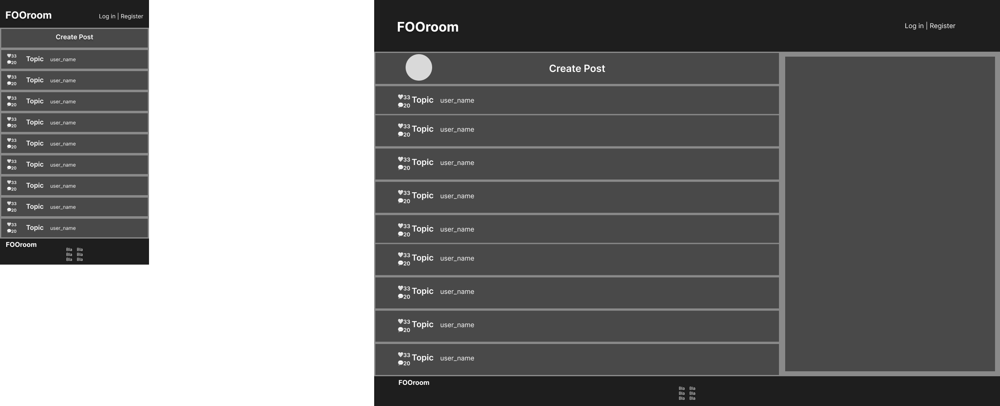
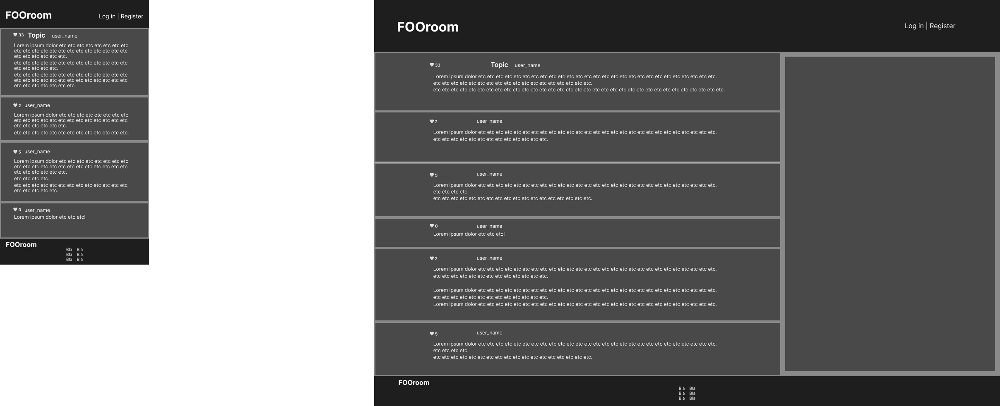
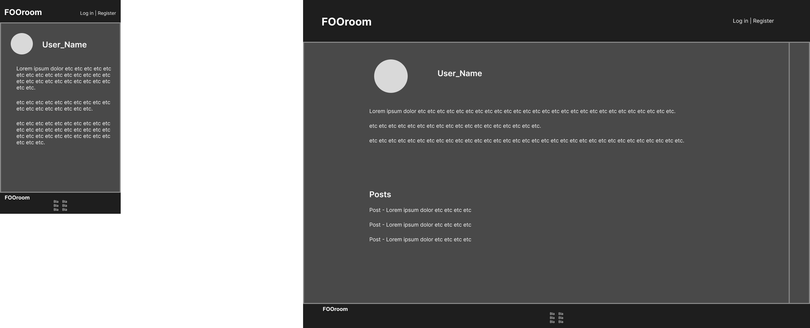

# FOOROOM

Fooroom is a forum site that aims to strike a happy middle ground between the modern format of Reddit and the sleek form and functionality of traditional bulletin board sites from decades past. Ease of use and no distractions make the foundation of this app's design philosophy.

Users can post, discuss, and interact without any unnecessary distractions.

[View the website here](#)

## Contents

* [Development Process](#development-process)

* [Features](#Features)
  * [Existing Features](#existing-features)
    * [Home page](#home-page)
    * [Post page](#post-page)
    * [Profile page](#profile-page)
    * [Register/Login page](#registerlogin-page)
  * [Future Implementations](#future-implementations)

* [User Experience](#User-Experience)
  * [User Stories](#User-Stories)

* [Deployment](#Deployment)

* [Design](#Design)
  * [Color Scheme](#Color-Scheme)
  * [Typography](#Typography)
  * [Agile Methodology](agile-methodology)
  * [Data Model](data-model)
  * [Images](#Images)
  * [Wireframe](#wireframe)
  * [Accessibility](#Accessibility)

* [Technologies Used](#Technologies-Used)
  * [Languages Used](#Languages-Used)
  * [Frameworks, Libraries & Programs Used](#frameworks-libraries--programs-used)

* [Testing](#Testing)
  * [Solved Bugs](#solved-bugs)
  * [Known Bugs](#unfixed-bugs)
  
* [Credits](#Credits)
  * [Content](#Content)
  * [Media](#Media)
  * [Tutorials & Code Used](#tutorials--code-used)

## Development Process

## Features

The site has two pages, one for the main menu and one for the game itself.

### Existing Features

#### Home Page:

__The home page has:__

#### Post Page:

__The Post page has:__

#### Profile Page:

#### Register/Login Page:

__The Post page has:__

__The Post page has:__

### Future Implementations:

## User Experience

### User stories

__Site owner / Administrator goals__

EPIC - Site Administration

* As a site admin, I can manage, edit, and delete content on the site

* As a site admin, I can delete user accounts from the site

__User goals__

EPIC - Site navigation

* As a site user, I can have a clear idea of the site as soon as I open it so that I can know whether I should stay there.

* As a site user, I can see how to navigate the site intuitively so that I can find what I want and find the around the site

* As a site user, I can see a segmented list of posts so that I can select what to read

* As a site user, I can click on a chosen post to see the whole post and its thread of comments on its own page

EPIC - User posting

* As a site user, I can submit a new post to the forum so that people can read my post

* As a site user, I can post replies to other people's posts and replies so that we can discuss the content of the post

* As a site user, I can edit or delete my posts so that I can correct mistakes

EPIC - User profile

* As a site user, I can upload a profile picture

* As a site user, I can view the profile page for my account and others

* As a site user, I can see my posts and profile picture on my profile page

## Design

### Color palette

### Typography

### Images

## Agile Methodology

## Data Model

### Wireframe

### Accessibility

## Technologies Used

### Languages Used

Python, HTML, CSS, and JavaScript.

### Frameworks & Libraries Used

Django

Bootstrap

### Other Technologies Used

VSCode - Used for all the coding.

Git - For version control.

GitHub - To store files and provide a live site.

Google Fonts - For stylish headings.

Google & Mozilla Developer Tools - For debugging and trying out design improvements on the fly.

GNU Image Manipulation Program - Cropping and scaling images for faster load times.

Am I Responsive - For testing how the site looks on different devices.

WAVE Evaluation Tool - To check accessibility.

Web Disability Simulator - To check accessibility.

realfavicongenerator.net/ - For the Favicon

## Deployment

### Heroku
The Application has been deployed from GitHub to Heroku following the steps:

1. Sign in or sign up at heroku.com
2. Create a new app with a unique app name and select your region
3. Click "Create app"
4. Click "Settings" and then "Config Vars", add a key called "PORT" with the value "8000" and (when making an app like this using an external worksheet) add another key with private API credentials in the value area.
5. Add any required buildpacks. This project uses Python and Node.js, with the latter being used for the terminal display and not the program itself.
6. Go to the "Deploy" tab and, under "Deployment method", select "GitHub." 
7. Insert the GitHub repository link or the name of the repository and click "Search" followed by "Connect" to deploy the GitHub repo to Heroku.
8. Next, you must select a branch of the repository for building the project, in this case "main."
9. Click "Deploy Branch" to deploy, or use "Enable Automatic Deploys" to make automatic deployments when the repo is updated.
10. You'll see a message saying “App was successfully deployed” when it's ready, and you click the "View" button to view the deployed project.

### GitHub

#### How to Fork the Repository

1. Sign in to GitHub.
2. Go to the repository for this project, [EmilionR/card-battle-pp2](https://github.com/EmilionR/card-battle-pp2/commits/main/)
3. Click the Fork button in the top right corner.

#### How to Clone the Repository

1. Log in (or sign up) to GitHub.
2. Go to the repository for this project, [EmilionR/card-battle-pp2](https://github.com/EmilionR/card-battle-pp2/commits/main/)
3. Click on the code button, select whether you would like to clone with HTTPS, SSH or GitHub CLI and copy the link shown.
4. Open the terminal in your code editor and change the current working directory to the location you want to use for the cloned directory.
5. Type 'git clone' into the terminal and then paste the link you copied in step 3. Press enter.

## Testing

Please refer to [TESTING.md](TESTING.md) for testing documentation.

### Solved Bugs

### Unfixed Bugs

## Credits

### Content

### Media

**Images used**

Grandmaster - [Generated with Night Cafe](https://creator.nightcafe.studio/)

Cat - [Photo by Raoul Droog](https://unsplash.com/photos/russian-blue-cat-wearing-yellow-sunglasses-yMSecCHsIBc?utm_content=creditCopyText&utm_medium=referral&utm_source=unsplash)
  
Mouse - [Photo by Joshua J. Cottenhttps](https://unsplash.com/photos/a-rat-sitting-on-a-piece-of-wood-QxW15BmJxOQ?utm_content=creditCopyText&utm_medium=referral&utm_source=unsplash)
  
  

### Tutorials & Code Used

Unique together, abstract classes, and more
https://docs.djangoproject.com/en/5.0/ref/models/options/

Signals used for automatically creating a profile when a new user is created and updating post activity when new comments are posted
https://simpleisbetterthancomplex.com/tutorial/2016/07/22/how-to-extend-django-user-model.html#onetoone
https://www.geeksforgeeks.org/how-to-create-and-use-signals-in-django/

Phind for help with the post form and edit model

For cloudinary and profile image form
https://cloudinary.com/blog/managing-media-files-in-django
https://developer.mozilla.org/en-US/docs/Web/API/HTMLFormElement/enctype

Shortening the datetime format
https://docs.python.org/3/library/datetime.html

CSRF without forms for the 'like' button AJAX code
https://stackoverflow.com/questions/7827079/django-csrf-token-without-forms

Queryset manipulation with Django Q model
https://docs.djangoproject.com/en/5.0/topics/db/queries/#complex-lookups-with-q-objects

Scrollbar styling
https://www.w3schools.com/howto/howto_css_custom_scrollbar.asp