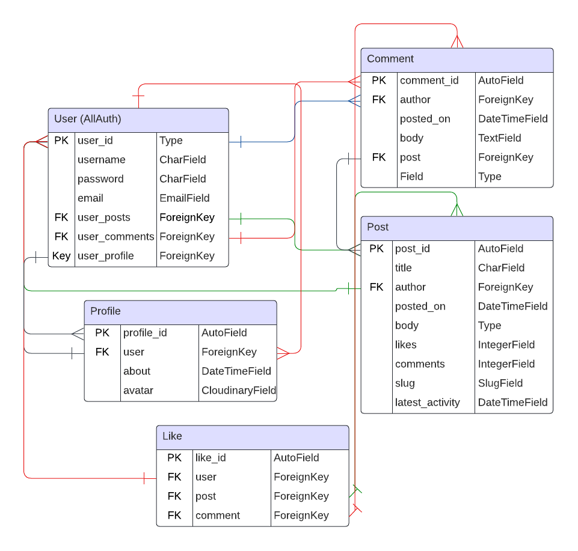

# FOOROOM

Fooroom is a forum site that aims to strike a happy middle ground between the modern format of Reddit and the sleek form and functionality of traditional bulletin board sites from decades past. Ease of use and no distractions make the foundation of this app's design philosophy.

Users can post, discuss, and interact without any unnecessary distractions.

[View the website here](https://fooroom-9cc630806337.herokuapp.com/)

## Contents

* [Development Process](#development-process)

* [Features](#Features)
  * [Existing Features](#existing-features)
    * [Home page](#home-page)
    * [Post page](#post-page)
    * [Profile page](#profile-page)
    * [Register/Login page](#registerlogin-page)
  * [Future Implementations](#future-implementations)
  * [Defensive Design Feaures](#defensive-design-features)

* [User Experience](#User-Experience)
  * [User Stories](#User-Stories)

* [Deployment](#Deployment)

* [Design](#Design)
  * [Color Scheme](#Color-Scheme)
  * [Typography](#Typography)
  * [Agile Methodology](agile-methodology)
  * [Data Model](data-model)
  * [Images](#Images)
  * [Wireframe](#wireframe)
  * [Accessibility](#Accessibility)

* [Technologies Used](#Technologies-Used)
  * [Languages Used](#Languages-Used)
  * [Frameworks, Libraries & Programs Used](#frameworks-libraries--programs-used)

* [Testing](#Testing)
  * [Solved Bugs](#solved-bugs)
  * [Known Bugs](#unfixed-bugs)
  
* [Credits](#Credits)
  * [Content](#Content)
  * [Media](#Media)
  * [Tutorials & Code Used](#tutorials--code-used)

## Development Process

## Features

The site has two pages, one for the main menu and one for the game itself.

### Existing Features

#### Home Page:

The home page displays a list of posts sorted by recent activity. Each post shows the avatar of the original poster along with information about when the post was posted, how many likes and comments it has, and when it got its latest comment. Clicking any of the posts opens the corresponding post as a new page. Posts designated as "sticky" are always displayed at the top of the list with a light border and an asterisk before the title.

The search bar lets users filter posts to easily find what they're looking for.

#### Post Page:

Here, users can see the full contents of a chosen post along with any comments it has. Comments are sorted from oldest to newest in descending order. Under the main content of each post, there's a like button with its associated counter. To the right of it, there are buttons for editing and deleting the post. Given an authenticated user, the buttons appear to give the user full CRUD capabilities. Any user assigned as staff or administrator also gets these controls for all posts and not just their own.

#### Profile Page:

On the profile page, an authenticated user can write a presentation and upload a profile picture. There's also a button for deleting the account. Users can also see a list of posts and comments made by the associated user, each one linking to its origin.

#### Register/Login Page:

The pages for account registration and user authentication are kept simple and clean. New users can sign up using a username, with email registration kept optional for a better user experience.

### Future Implementations:

The main thing I'd change in the future is the setup for image hosting and external resources. With the current setup, I can't access and change certain factors that are detrimental to page loading and general performace. Cloudinary is slow, Summernote's internal structure doesn't fully comply with current best practices, and the bootstrap imports redundant data. In the scope of a bigger project, I'd have dealt with this, but it wasn't a feasible investment of time for this study project.

In a potential future iteration, I'd also like to add private messaging and a friend system. The list view and post detail view should also enable sorting choices.

### Defensive Design Features

These are the features I have implemented for defensive design.

* Authentication checks
  * With the @login_required decorator on certain views, I restrict access for unauthenticated users.
  * Using Django's UserPassesTestMixin, I ensure that users can not edit other user's posts (unless they have administrator access)
  * Admin features are only accessible if signed in as a superuser
  * I refrained from using the @csrf_exempt decorator for ajax calls to avoid potential cross-site exploits
  * Manually inputting URLs to sensitive endpoints such as account deletion does not grant access

* Form validation
  * If a form contains any invalid data on submission, it will refuse to submit and instead warn the user
  * Image file size is restricted using a custom validator
  * Model fields that can be manipulated have default values and restrictions such as maximum character count
  * CSRF token checks ensure that forms can only be submitted by users on the site
  * No base forms that could enable code injection

* Backup and default values
  * Image fields have a placeholder to prevent broken links
  * Profiles, images, and more have a creation routine that automatically adds them to prevent null references
  * Template tags check for placeholders and nonexistent values before rendering anything to the page

* Error pages
  * A custom 404 page appears if users try to visit a non-existent page. The page features a button for returning to the home page.
  * A custom 500 page appears if the site encounters a server error trying to load content. The same "return to home" button is found here too.

## User Experience

### User stories

__Site owner / Administrator goals__

EPIC - Site Administration

* As a site admin, I can manage, edit, and delete content on the site

* As a site admin, I can delete user accounts from the site

__User goals__

EPIC - Site navigation

* As a site user, I can have a clear idea of the site as soon as I open it so that I can know whether I should stay there.

* As a site user, I can see how to navigate the site intuitively so that I can find what I want and find the around the site

* As a site user, I can see a segmented list of posts so that I can select what to read

* As a site user, I can click on a chosen post to see the whole post and its thread of comments on its own page

EPIC - User posting

* As a site user, I can submit a new post to the forum so that people can read my post

* As a site user, I can post replies to other people's posts and replies so that we can discuss the content of the post

* As a site user, I can edit or delete my posts so that I can correct mistakes

* As a site user, I can like posts and see how many likes a post has

EPIC - User profile

* As a site user, I can upload a profile picture

* As a site user, I can view the profile page for my account and others

* As a site user, I can see my posts and profile picture on my profile page

## Design

### Color palette

I decided from the start that I wanted a "night mode" design for this site, but not just grayscale. I went with muted purple tones. This palette is consistently applied across the whole site, including widgets. Certain important buttons are kept red to highlight their nature, but everything else adheres to the color theme.

### Typography

For this site, I kept it simple with a clean sans-serif font across the whole site. Roboto is the name of the font, which I imported from Google Fonts.

### Images

The site uses no imagery of its own and instead leaves the whole image space for users' profile pictures.

## Agile Methodology

I used GitHub projects to manage this project's development stages using Agile methodology. You can see my [iterations](https://github.com/EmilionR/django-pp4/milestones) and [project board](https://github.com/users/EmilionR/projects/4/views/1) to learn more.

After breaking up the epics into user stories, I added all the user stories to the Issues page and connected them to the project board. I then set up milestones for each iteration and sorted relevant user stories into the corresponding iteration milestone based on urgency and importance. I kept iterations short and somewhat flexible.
Each user story has a list of acceptance criteria and associated tasks, each one with a checkbox for easy tracking of progress.

## Data Model

I used a PostgreSQL relational database for this project. The entity relationship diagram (ERD) above represents the database of the project. The one below represents the original idea I envisioned before building the program.
I had to make some alterations to harmonize better with Django's modular design and safety features.

I use a highly object-oriented design for the project, using abstraction and mixins where applicable to reduce repetitions and redundancy. For example, I have an abstract model laying the foundation for posts and comments. I had to break away from this abstraction a few times due to the way django handles certain relations.

The models for posts and comments are there to let users create content. Each time a user submits a post or comment, a new object based its model is created. Similarly, a profile object is assigned to each new user created. And each time a user likes a post or a comment, this creates a new like object pairing the user and the entry so that users can only like any given entry once.

### Wireframe

### Accessibility

## Technologies Used

### Languages Used

Python, HTML, CSS, and JavaScript.

### Frameworks & Libraries Used

Django

Bootstrap

### Other Technologies Used

VSCode - Used for all the coding.

Git - For version control.

GitHub - To store files and provide a live site.

Google Fonts - For stylish headings.

Google & Mozilla Developer Tools - For debugging and trying out design improvements on the fly.

GNU Image Manipulation Program - Cropping and scaling images for faster load times.

Am I Responsive - For testing how the site looks on different devices.

WAVE Evaluation Tool - To check accessibility.

Web Disability Simulator - To check accessibility.

realfavicongenerator.net/ - For the Favicon

## Deployment

### Heroku
The Application has been deployed from GitHub to Heroku following the steps:

1. Sign in or sign up at heroku.com
2. Create a new app with a unique app name and select your region
3. Click "Create app"
4. Click "Settings" and then "Config Vars", add a key called "PORT" with the value "8000" and (when making an app like this using an external worksheet) add another key with private API credentials in the value area.
5. Add any required buildpacks. This project uses Python and Node.js, with the latter being used for the terminal display and not the program itself.
6. Go to the "Deploy" tab and, under "Deployment method", select "GitHub." 
7. Insert the GitHub repository link or the name of the repository and click "Search" followed by "Connect" to deploy the GitHub repo to Heroku.
8. Next, you must select a branch of the repository for building the project, in this case "main."
9. Click "Deploy Branch" to deploy, or use "Enable Automatic Deploys" to make automatic deployments when the repo is updated.
10. You'll see a message saying “App was successfully deployed” when it's ready, and you click the "View" button to view the deployed project.

### GitHub

#### How to Fork the Repository

1. Sign in to GitHub.
2. Go to the repository for this project, [EmilionR/card-battle-pp2](https://github.com/EmilionR/card-battle-pp2/commits/main/)
3. Click the Fork button in the top right corner.

#### How to Clone the Repository

1. Log in (or sign up) to GitHub.
2. Go to the repository for this project, [EmilionR/card-battle-pp2](https://github.com/EmilionR/card-battle-pp2/commits/main/)
3. Click on the code button, select whether you would like to clone with HTTPS, SSH or GitHub CLI and copy the link shown.
4. Open the terminal in your code editor and change the current working directory to the location you want to use for the cloned directory.
5. Type 'git clone' into the terminal and then paste the link you copied in step 3. Press enter.

## Testing

Please refer to [TESTING.md](TESTING.md) for testing documentation.

### Solved Bugs

### Unfixed Bugs

## Credits

### Content

### Media

**Images used**

Grandmaster - [Generated with Night Cafe](https://creator.nightcafe.studio/)

Cat - [Photo by Raoul Droog](https://unsplash.com/photos/russian-blue-cat-wearing-yellow-sunglasses-yMSecCHsIBc?utm_content=creditCopyText&utm_medium=referral&utm_source=unsplash)
  
Mouse - [Photo by Joshua J. Cottenhttps](https://unsplash.com/photos/a-rat-sitting-on-a-piece-of-wood-QxW15BmJxOQ?utm_content=creditCopyText&utm_medium=referral&utm_source=unsplash)

### Tutorials & Code Used

Unique together, abstract classes, and more
https://docs.djangoproject.com/en/5.0/ref/models/options/

Signals used for automatically creating a profile when a new user is created and updating post activity when new comments are posted
https://simpleisbetterthancomplex.com/tutorial/2016/07/22/how-to-extend-django-user-model.html#onetoone
https://www.geeksforgeeks.org/how-to-create-and-use-signals-in-django/

Phind for help with the post form and edit model

For cloudinary and profile image form
https://cloudinary.com/blog/managing-media-files-in-django
https://developer.mozilla.org/en-US/docs/Web/API/HTMLFormElement/enctype

Shortening the datetime format
https://docs.python.org/3/library/datetime.html

CSRF without forms for the 'like' button AJAX code
https://stackoverflow.com/questions/7827079/django-csrf-token-without-forms

Queryset manipulation with Django Q model
https://docs.djangoproject.com/en/5.0/topics/db/queries/#complex-lookups-with-q-objects

Scrollbar styling
https://www.w3schools.com/howto/howto_css_custom_scrollbar.asp

Summernote form integration
https://github.com/summernote/django-summernote?tab=readme-ov-file#form