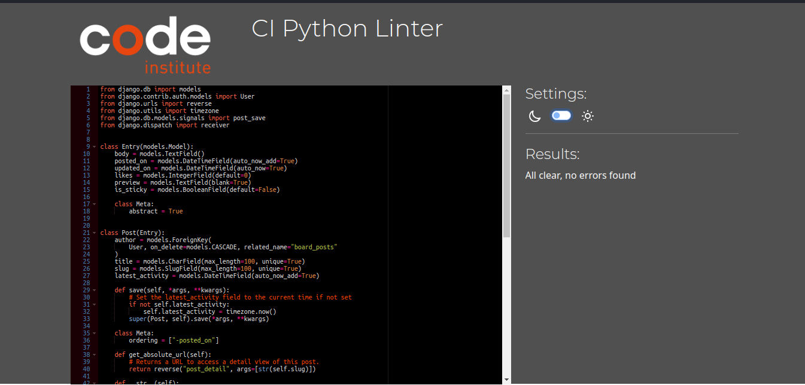

# Table of Contents
* [User Story Testing](#user-story-testing)
* [Validator Testing](#validator-testing)
  * [Python](#python)
  * [Javascript](#javascript)
  * [HTML](#html)
  * [CSS](#css)
  * [Lighthouse](#lighthouse)
  * [Custom Automated Testing](#custom-automated-testing)
* [Manual Testing](#manual-testing)
  * [Site Navigation](#site-navigation)
  * [Home Page](#home-page)
  * [Post Page](#post-page)
  * [Profile Page](#profile-page)
  * [Django All Auth Pages](#django-all-auth-pages)

[Back to README](README.md)

## User Story Testing

### EPIC | User Profile

__Site owner / Administrator goals__

EPIC - Site Administration

| Goals | How are they achieved? |
| --- | --- |
| As a site admin, I can manage, edit, and delete content on the site | Admin users can edit and delete content both on site and from the admin panel |
| As a site admin, I can delete user accounts from the site | Accounts can be deleted from the admin panel |

__User goals__

EPIC - Site navigation

| Goals | How are they achieved? |
| --- | --- |
| As a site user, I can have a clear idea of the site as soon as I open it so that I can know whether I should stay there. | The home page presents the site content, and all other user pages can be accessed from it |
| As a site user, I can see how to navigate the site intuitively so that I can find what I want and find the around the site | A simple navbar is present on all pages |
| As a site user, I can see a segmented list of posts so that I can select what to read | Posts appear in a neat list on the main page |
| As a site user, I can click on a chosen post to see the whole post and its thread of comments on its own page | Clicking a post opens its page where users can see its content and comments |

EPIC - User posting

| Goals | How are they achieved? |
| --- | --- |
| As a site user, I can submit a new post to the forum so that people can read my post | New posts can be submitted from the main page |
| As a site user, I can post replies to other people's posts and replies so that we can discuss the content of the post | Comments can be submitted from the post detail page |
| As a site user, I can edit or delete my posts so that I can correct mistakes | Users can edit and delete their own posts using buttons directly on the post |
| As a site user, I can like posts and see how many likes a post has | Each post and comment has a like button and a like counter |

EPIC - User profile

| Goals | How are they achieved? |
| --- | --- |
| As a site user, I can upload a profile picture | The profile page has a form with an image uploading button |
| As a site user, I can view the profile page for my account and others | Profile pages are accessed by clicking usernames and avatars |
| As a site user, I can see my posts and profile picture on my profile page | Each profile page has a list of posts and comments by the associated user |

## Validator Testing

### Python

All Python files were run validated with pep8 and cleaned until no errors were found.

Python validation results

### Javascript

All JavaScript files were validated with jshint and return no errors.

JavaScript validation results

### HTML

I validated my HTML pages using the W3 Nu HTML Checker. You can check the results for each page below.
While the test for the profile page warns about some errors, these are caused by a clash between Summernote and the validator.
Similarly, the signup page warns about some tags left by the form rendered from django.allauth

[Home page](https://validator.w3.org/nu/?doc=https%3A%2F%2Ffooroom-9cc630806337.herokuapp.com%2F)

[Post page](https://validator.w3.org/nu/?doc=https%3A%2F%2Ffooroom-9cc630806337.herokuapp.com%2Fwhat-song-is-this%2F)

[Profile](https://validator.w3.org/nu/?doc=https%3A%2F%2Ffooroom-9cc630806337.herokuapp.com%2Fprofile%2FGrandmaster%2F)

[Signup page](https://fooroom-9cc630806337.herokuapp.com/accounts/signup/)

[Login](https://fooroom-9cc630806337.herokuapp.com/accounts/login/)

[Logout](https://validator.w3.org/nu/?doc=https%3A%2F%2Ffooroom-9cc630806337.herokuapp.com%2F)

### CSS

I validated my CSS with the Jigsaw CSS validator and it came back without any errors. When validating by url, some minor bootstrap-specific warnings may appear, but that's par for the course when using bootstrap. These warnings don't appear when uploading the css file or pasting the page source.

[CSS results](https://jigsaw.w3.org/css-validator/validator?uri=https%3A%2F%2Ffooroom-9cc630806337.herokuapp.com%2Fwhat-song-is-this%2F&profile=css3svg&usermedium=all&warning=1&vextwarning=&lang=sv)

### Lighthouse

I used Lighthouse to test all pages. While the scores are not perfect, the main culprit for this is found in the widgets and frameworks used. There wasn't much I could do to abate this issue within the scope of the project. Loading images from cloudinary is quite slow, bootstrap loads unneccessary data, summernote has some deprecated code that isn't fully compliant with today's best practices.
Overall, the site still scores approximately on par with similar sites such as Reddit.

__Desktop__

| Page         | Performance | Accessibility | Best Practices | SEO |
|--------------|-------------|---------------|----------------|-----|
| Home         |         100 |            92 |             72 | 100 |
| Post Detail  |          99 |            95 |             75 | 100 |
| Profile page |          93 |            98 |             75 | 100 |
| Login        |         100 |            94 |            100 | 100 |
| Logout       |         100 |           100 |            100 | 100 |
| Register     |         100 |            94 |            100 | 100 |

__Mobile__

| Page         | Performance | Accessibility | Best Practices | SEO |
|--------------|-------------|---------------|----------------|-----|
| Home         |          96 |            92 |             72 | 100 |
| Post Detail  |          81 |            95 |             75 | 100 |
| Profile page |          82 |            98 |             75 | 100 |
| Login        |          95 |            94 |            100 | 100 |
| Logout       |          97 |           100 |            100 | 100 |
| Register     |          97 |            94 |            100 | 100 |

### Custom Automated Testing

In addition to the various validators and automated tests above, I created my own tests to test my python code.
Using Django's testing features, I created 27 tests for the various models, views, and forms used across the apps that make up the project. I then used these tests to iron out bugs and oversights. For example, my tests check whether the search function returns a properly sorted list and whether uploaded images meet the filesize restrictions. All tests now pass consistently.

These tests work by setting up a testing environment and creating mock data to test the functions and features of the project. That lets me do rapid and repeated tests without manual input. And since it's done in a virtual testing environment that is destroyed after each test run, I don't have to clean out junk data from the actual database after testing.

## Manual Testing

__Browser Testing__

I have tested this site on the following browsers:

* Google Chrome
* Mozilla Firefox
* Brave
* Safari
* Microsoft Edge

__Device Testing__

* Lenovo Thinkpad t480
* Samsung Galaxy S23
* Samsung Galaxy S22
* Samsung Galaxy S9

### Site Navigation

| Feature | Expected Outcome | Testing Performed | Pass/Fail |
| --- | --- | --- | --- |
| Navbar Logo | Hover/Focus | Indicate focus | Pass |
| Navbar Logo | Click | Redirect to home | Pass |
| Navbar toggler | Display | Visible on small screens only | Pass |
| Navbar toggler | Click | Opens dropdown with navigation links | Pass |
| Navbar Links | Display | Links display in header on screens above a certain size | Pass |
| Profile Link | Display | Only display when user is signed in | Pass |
| Profile Link | Hover/Focus | Indicate focus | Pass |
| Profile Link | Click | Open profile page | Pass |
| Register Link | Display | Only display when user is not signed in | Pass |
| Register Link | Hover/Focus | Indicate focus | Pass |
| Register Link | Click | Open signup page | Pass |
| Log-in Link | Display | Only display when user is not signed in | Pass |
| Log-in Link | Hover/Focus | Indicate focus | Pass |
| Log-in Link | Click | Open login page | Pass |
| Log-out Link | Display | Only display when user is signed in | Pass |
| Log-out Link | Hover/Focus | Indicate focus | Pass |
| Log-out Link | Click | Open login page | Pass |
| Footer Links | Display | Icons for Github and LinkedIn appear | Pass |
| Footer Links | Hover/Focus | Indicate focus | Pass |
| Footer Links | Click | Open link in new page | Pass |

### Home Page
| Feature | Expected Outcome | Testing Performed | Pass/Fail |
| --- | --- | --- | --- |
| Post list | Display | All posts appear in sorted order | Pass |
| Post list | Display | Posts move to top when commented | Pass |
| Post list | Display | Sticky posts appear on top with a thumbtack icon | Pass |
| Post | Display | Post displays title, author, and time of posting | Pass |
| Post | Display | Post displays likes, comments, and latest activity | Pass |
| Avatar | Display | Avatars display on screens above a certain size | Pass |
| Avatar | Click | Clicking an avatar opens the associated profile page | Pass |
| Post Links | Hover/Focus | Indicate focus | Pass |
| Title Link | Click | Open post detail page | Pass |
| Author Link | Click | Open the associated profile page | Pass |
| Heart Counter | Display | Display the correct number of likes received by the post | Pass |
| Comment Counter | Display | Display the correct number of comments on the post | Pass |
| 'Latest' Section | Display | Display the time of the latest comment | Pass |
| Search Bar | Display | Align self to center on small screens, right on large screens | Pass |
| Search Bar | Submit | Apply search term and filter posts | Pass |
| 'New Post' Button | Display | Align self to center on small screens, right on large screens | Pass |
| 'New Post' Button | Hover/Focus | Indicate focus | Pass |
| 'New Post' Button | Click | Open post form | Pass |

### Post Form
| Feature | Expected Outcome | Testing Performed | Pass/Fail |
| --- | --- | --- | --- |
| Content | Display | Display "You must log in" message to unauthenticated users | Pass |
| Content | Display | Display heading and two input fields | Pass |
| Title Field | Input | Limit input length | Pass |
| Body Field | Editor | Display Summernote editor with customized toolbar | Pass |
| Close Button | Display | Hang in the top-right corner | Pass |
| Close Button | Hover/Focus | Indicate focus | Pass |
| Close Button | Click | Close the Post form | Pass |
| Submit Button | Hover/Focus | Indicate focus | Pass |
| Submit Button | Click | Submit the form and add post to database | Pass |

### Post Detail
| Feature | Expected Outcome | Testing Performed | Pass/Fail |
| --- | --- | --- | --- |
| Post | Display | Post displays title, author, and time of posting | Pass |
| Post | Display | Post displays likes, comments, and latest activity | Pass |
| Post Links | Hover/Focus | Indicate focus | Pass |
| Title Link | Click | Open post detail page | Pass |
| Author Link | Click | Open the associated profile page | Pass |
| Avatar | Display | Avatars display on screens above a certain size | Pass |
| Avatar | Click | Clicking an avatar opens the associated profile page | Pass |
| Body | Display | Display post body with proper formatting | Pass |
| 'Updated' Message | Display | If post has been edited, display an update message with a timestamp | Pass |
| Like Button | Display | Display as heart icon | Pass |
| Like Button | Hover/Focus | Indicate focus | Pass |
| Like Button | Click (Authenticated) | Like/unlike the post and increment/decrement like count | Pass |
| Like Button | Click (Unauthenticated) | Do nothing | Pass |
| Like Counter | Display | Display the correct number of likes received by the post | Pass |
| Comment Counter | Display | Display the correct number of comments on the post | Pass |
| Edit Button | Display |  Display if logged in as the author of the post | Pass |
| Edit Button | Display |  Display if logged in as superuser or staff | Pass |
| Edit Button | Click | Open editing page | Pass |
| Delete Button | Display |  Display if logged in as the author of the post | Pass |
| Delete Button | Display |  Display if logged in as superuser or staff | Pass |
| Delete Button | Click | Delete the post | Pass |
| Comment Button | Display | Display between post and comments | Pass |
| Comment Button | Hover/Focus | Indicate focus | Pass |
| Comment Button | Click | Open comment form | Pass |

### Comment Form
| Feature | Expected Outcome | Testing Performed | Pass/Fail |
| --- | --- | --- | --- |
| Content | Display | Display "You must log in" message to unauthenticated users | Pass |
| Content | Display | Display heading and input field | Pass |
| Body Field | Editor | Display Summernote editor with customized toolbar | Pass |
| Close Button | Display | Hang in the top-right corner | Pass |
| Close Button | Hover/Focus | Indicate focus | Pass |
| Close Button | Click | Close the Comment form | Pass |
| Submmit Button | Hover/Focus | Indicate focus | Pass |
| Submit Button | Click | Submit the form and add comment to database | Pass |

### Comment
| Feature | Expected Outcome | Testing Performed | Pass/Fail |
| --- | --- | --- | --- |
| Comments | Display | Display list of comments below post | Pass |
| Sticky Comment | Display | Sticky comments display at the top, below the post | Pass |
| Comment | Display | Comment displays title, author, and time of posting | Pass |
| Comment | Display | Comment displays likes, comments, and latest activity | Pass |
| Comment Links | Hover/Focus | Indicate focus | Pass |
| Author Link | Click | Open the associated profile page | Pass |
| Avatar | Display | Avatars display on screens above a certain size | Pass |
| Avatar | Click | Clicking an avatar opens the associated profile page | Pass |
| Body | Display | Display comment body with proper formatting | Pass |
| 'Updated' Message | Display | If comment has been edited, display an update message with a timestamp | Pass |
| Like Button | Display | Display as heart icon | Pass |
| Like Button | Hover/Focus | Indicate focus | Pass |
| Like Button | Click (Authenticated) | Like/unlike the comment and increment/decrement like count | Pass |
| Like Button | Click (Unauthenticated) | Do nothing | Pass |
| Like Counter | Display | Display the correct number of likes received by the comment | Pass |
| Edit Button | Display |  Display if logged in as the author of the comment | Pass |
| Edit Button | Display |  Display if logged in as superuser or staff | Pass |
| Edit Button | Click | Open editing page | Pass |
| Delete Button | Display |  Display if logged in as the author of the comment | Pass |
| Delete Button | Display |  Display if logged in as superuser or staff | Pass |
| Delete Button | Click | Delete the comment | Pass |

# Editing Page
| Feature | Expected Outcome | Testing Performed | Pass/Fail |
| --- | --- | --- | --- |
| Body Field | Editor | Display Summernote editor with customized toolbar | Pass |
| Submmit Button | Hover/Focus | Indicate focus | Pass |
| Submit Button | Click | Submit the form and update the post in the database | Pass |

### Profile Page
| Feature | Expected Outcome | Testing Performed | Pass/Fail |
| --- | --- | --- | --- |
| Heading | Display | Display username | Pass |
| Heading | Display | Display admin status if signed in as superuser or staff | Pass |
| Profile picture | Display | Display placeholder image if no image has been uploaded | Pass |
| Profile picture | Display | Display the user's latest uploaded image | Pass |
| Info Section | Display | Display user-defined information | Pass |
| 'Edit Profile' Button | Display | Display if signed in as profile owner | Pass |
| 'Edit Profile' Button | Hover/Focus | Indicate focus | Pass |
| 'Edit Profile' Button | Click | Open profile editing form | Pass |
| 'Delete Account' Button | Display | Display if signed in as profile owner | Pass |
| 'Delete Account' Button | Hover/Focus | Indicate focus | Pass |
| 'Delete Account' Button | Click | Delete the account | Pass |
| Post List | Display | Display list of posts by the associated user in container | Pass |
| Comment List | Display | Display list of comments by the associated user in container | Pass |
| List Containers | Display | Display side by side on large screens, stacked on smaller screens | Pass |
| List Entry | Display | Display the text body | Pass |
| List Entry | Hover/Focus | Indicate focus | Pass |
| List Entry | Click | Open the corresponding post | Pass |
| Post List Entry | Display  | Display post title | Pass |
| Comment List Entry | Display  | Display post title and author | Pass |

### Edit Profile Form
| Feature | Expected Outcome | Testing Performed | Pass/Fail |
| --- | --- | --- | --- |
| Image Uploader | Display | Display a message about maximum file size | Pass |
| Image Uploader | Click | Users can upload an image from their computer | Pass |
| Image Uploader | Click | Images larger than 0.5mb are rejected | Pass |
| About Field | Editor | Display Summernote editor with customized toolbar | Pass |
| Cancel Button | Hover/Focus | Indicate focus | Pass |
| Cancel Button | Click | Close the Comment form | Pass |
| Submit Button | Hover/Focus | Indicate focus | Pass |
| Submit Button | Click | Validate form fields and update one or both if valid | Pass |
| Submit Button | Click | Submit the form and add update the profile in the database | Pass |

[Back to README](README.md)