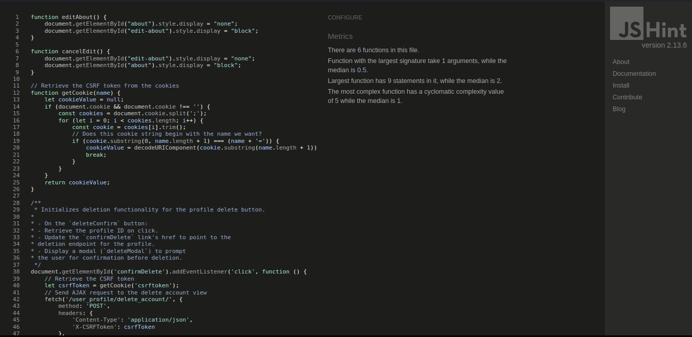

# Table of Contents
* [User Story Testing](#user-story-testing)
* [Validator Testing](#validator-testing)
  * [Python](#python)
  * [Javascript](#javascript)
  * [HTML](#html)
  * [CSS](#css)
  * [Lighthouse](#lighthouse)
* [Manual Testing](#manual-testing)
  * [Site Navigation](#site-navigation)
  * [Home Page](#home-page)
  * [Post Page](#)
  * [Profile Page](#)
  * [Django All Auth Pages](#django-all-auth-pages)

## User Story Testing

### EPIC | User Profile

__Site owner / Administrator goals__

EPIC - Site Administration

| Goals | How are they achieved? |
| --- | --- |
| As a site admin, I can manage, edit, and delete content on the site | Admin users can edit and delete content both on site and from the admin panel |
| As a site admin, I can delete user accounts from the site | Accounts can be deleted from the admin panel |

__User goals__

EPIC - Site navigation

| Goals | How are they achieved? |
| --- | --- |
| As a site user, I can have a clear idea of the site as soon as I open it so that I can know whether I should stay there. | The home page presents the site content, and all other user pages can be accessed from it |
| As a site user, I can see how to navigate the site intuitively so that I can find what I want and find the around the site | A simple navbar is present on all pages |
| As a site user, I can see a segmented list of posts so that I can select what to read | Posts appear in a neat list on the main page |
| As a site user, I can click on a chosen post to see the whole post and its thread of comments on its own page | Clicking a post opens its page where users can see its content and comments |

EPIC - User posting

| Goals | How are they achieved? |
| --- | --- |
| As a site user, I can submit a new post to the forum so that people can read my post | New posts can be submitted from the main page |
| As a site user, I can post replies to other people's posts and replies so that we can discuss the content of the post | Comments can be submitted from the post detail page |
| As a site user, I can edit or delete my posts so that I can correct mistakes | Users can edit and delete their own posts using buttons directly on the post |
| As a site user, I can like posts and see how many likes a post has | Each post and comment has a like button and a like counter |

EPIC - User profile

| Goals | How are they achieved? |
| --- | --- |
| As a site user, I can upload a profile picture | The profile page has a form with an image uploading button |
| As a site user, I can view the profile page for my account and others | Profile pages are accessed by clicking usernames and avatars |
| As a site user, I can see my posts and profile picture on my profile page | Each profile page has a list of posts and comments by the associated user |

## Validator Testing

### Python

All Python files were run validated with pep8 and cleaned until no errors were found.

Python validation results

### Javascript

All JavaScript files were validated with jshint and return no errors.

JavaScript validation results

### HTML

### CSS

I validated my CSS with the Jigsaw CSS validator and it came back without any errors. When validating by url, some minor bootstrap-specific warnings may appear, but that's par for the course when using bootstrap. These warnings don't appear when uploading the css file or pasting the page source.

[CSS results](https://jigsaw.w3.org/css-validator/validator?uri=https%3A%2F%2Ffooroom-9cc630806337.herokuapp.com%2Fwhat-song-is-this%2F&profile=css3svg&usermedium=all&warning=1&vextwarning=&lang=sv)

### Lighthouse

I used Lighthouse to test all pages. While the scores are not perfect, the main culprit for this is found in the widgets and frameworks used. There wasn't much I could do to abate this issue within the scope of the project. Loading images from cloudinary is quite slow, bootstrap loads unneccessary data, summernote has some deprecated code that isn't fully compliant with today's best practices.
Overall, the site still scores approximately on par with similar sites such as Reddit.

__Desktop__

| Page         | Performance  | Accessibility | Best Practices  | SEO |
|--------------|--------------|---------------|-----------------|-----|
| Home         |          000 |           000 |             000 | 000 |
| Post Detail  |           00 |           000 |             000 | 000 |
| Profile page |           00 |           000 |             000 | 000 |
| Login        |           00 |           000 |             000 | 000 |
| Logout       |           00 |           000 |             000 | 000 |
| Register     |           00 |           000 |             000 | 000 |

__Mobile__

| Page         | Performance  | Accessibility | Best Practices  | SEO |
|--------------|--------------|---------------|-----------------|-----|
| Home         |          000 |           000 |             000 | 000 |
| Post Detail  |           00 |           000 |             000 | 000 |
| Profile page |           00 |           000 |             000 | 000 |
| Login        |           00 |           000 |             000 | 000 |
| Logout       |           00 |           000 |             000 | 000 |
| Register     |           00 |           000 |             000 | 000 |

## Manual Testing

__Browser Testing__

I have tested this site on the following browsers:

* Google Chrome
* Mozilla Firefox
* Brave
* Safari
* Microsoft Edge

__Device Testing__

* Lenovo Thinkpad t480
* Samsung Galaxy S23
* Samsung Galaxy S22
* Samsung Galaxy S9

### Site Navigation

| Feature | Expected Outcome | Testing Performed | Pass/Fail |
| --- | --- | --- | --- |
|  |  |  |  |
|  |  |  |  |
|  |  |  |  |
|  |  |  |  |

### Home Page
| Feature | Expected Outcome | Testing Performed | Pass/Fail |
| --- | --- | --- | --- |
|  |  |  |  |
|  |  |  |  |
|  |  |  |  |
|  |  |  |  |

### Post Detail
| Feature | Expected Outcome | Testing Performed | Pass/Fail |
| --- | --- | --- | --- |
|  |  |  |  |
|  |  |  |  |
|  |  |  |  |
|  |  |  |  |

### Profile Page
| Feature | Expected Outcome | Testing Performed | Pass/Fail |
| --- | --- | --- | --- |
|  |  |  |  |
|  |  |  |  |
|  |  |  |  |
|  |  |  |  |